                                     

# Tema 1. Introducción a Visual Studio.NET

[*1.	Introducción*](#_apartado1)

[*2.	Introducción a .NET*](#_apartado2)

[*3.	Instalación de Visual Studio 2022*](#_apartado3)

[*4.	Explorar el entorno de desarrollo*](#_apartado4)

[*5.	Ejemplo de Proyecto Visual C#*](#_apartado5)


# <a name="_apartado1"></a>1. Introducción.
El objetivo del módulo de Programación será aprender a programar de una forma correcta. 

Programar consistirá en escribir un conjunto de instrucciones para conseguir que el ordenador resuelva un problema concreto. El resultado será un programa en un determinado lenguaje de programación.

Seguiremos una serie de fases en el proceso de programación:

- **Planteamiento del problema**. Deberemos tener muy claro cuál es el problema qué nos están pidiendo resolver.
- **Análisis**, mediante el cual se obtiene un algoritmo que resuelve el problema. Denominaremos **algoritmo** a cualquier método que permita resolver un problema mediante una secuencia precisa, determinista y finita de pasos.
- **Programación**, consistirá en traducir el algoritmo a un lenguaje de programación, en nuestro caso Visual C#, e introducirlo en el ordenador.
- **Compilación** del programa fuente para la obtención del programa objeto. El proceso de compilación convertirá el código escrito en un lenguaje de programación a código ejecutable por el ordenador.
- **Ejecución y prueba** del programa. Una vez compilado el programa deberemos ejecutarlo comprobando que resuelve el problema planteado. Si no es así se deberá volver a las fases anteriores.

Al realizar un programa es necesario comprobar que no existen errores en el mismo. Existen 2 tipos de errores:

- Sintácticos 
- Lógicos 

Los **errores sintácticos** son errores en la sintaxis del lenguaje, es decir, no hemos seguido las reglas del lenguaje de programación elegido. 

Si pensamos en lenguajes como el castellano o el inglés sería similar a la construcción incorrecta de una frase o un texto.

Se detectan a través de un software específico: **Los compiladores.** 

Un **compilador** realiza la comprobación de errores sintácticos antes de la ejecución del programa, en un proceso que recibe el nombre de compilación, en este proceso se realiza una verificación sintáctica de todas las líneas que componen el programa, realizándose al final del proceso un listado de todos los errores encontrados en el programa.

Cuando el programa no contiene errores sintácticos podrá ser ejecutado. 

Los **errores lógicos** son aquellos que se detectan durante la ejecución del programa al no registrar las salidas o resultados previstos según la entrada de los datos. Es decir, cuando el programa que hemos desarrollado no resuelve el problema planteado.

Siguiendo con lo dicho anteriormente es como si nuestra frase o texto en castellano tiene una construcción correcta pero su significado no es el que nosotros queríamos expresar.

# <a name="_apartado2"></a>2. Introducción a .NET
Los lenguajes de programación juegan un papel fundamental en Informática: actúan como enlace entre los problemas a resolver (aplicaciones) y la máquina que los resuelve (hardware).

Una posible definición de lenguaje de programación podría ser: Un lenguaje de programación es una notación para describir **algoritmos** y **estructuras de datos**, y que pueden ser evaluados por un computador.

Los primeros lenguajes de programación estaban orientados hacia la máquina y se les etiqueta como **lenguajes de bajo nivel**. Dentro de los lenguajes de bajo nivel se puede distinguir entre lenguaje máquina y lenguaje ensamblador.

Posteriormente se desarrollaron los llamados **lenguajes de alto nivel**. Estos lenguajes son independientes de la máquina y tienen una serie de características fundamentales:

- Cercanos al lenguaje natural (normalmente al inglés), pero con una sintaxis muy rígida. 
- Compilables. Traducción automática a lenguaje máquina. 
- Elevado rendimiento.

Nosotros, durante el curso, vamos a utilizar básicamente el lenguaje de programación **Visual C#** (léase C Sharp) sobre la nueva plataforma de Microsoft **.NET**.

La **plataforma .NET** permite conectar sistemas, información, dispositivos y usuarios distintos de un modo más unificado y personalizado.

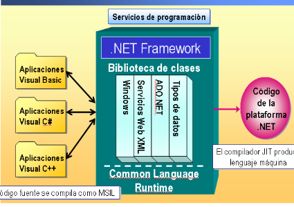


El .NET Framework es un conjunto de servicios de programación diseñados para simplificar el desarrollo de aplicaciones sobre el entorno distribuido de Internet. El .NET Framework tiene dos componentes principales: el Common Language Runtime y la biblioteca de clases.

Cuando creamos una nueva aplicación Windows en Visual C# .NET, se nos proporciona un código inicial que incluye el espacio de nombres **System.Windows.Forms** y la clase **Form**. Con esta clase, podemos crear fácilmente ventanas, botones, menús, barras de herramientas y otros elementos de pantalla. Cuando compilamos la aplicación, el código se traduce al lenguaje común del entorno de ejecución llamado Common Intermediate Language (CIL), anteriormente conocido como Microsoft Intermediate Language (MSIL). Una vez la aplicación se ha compilado, el entorno de ejecución gestiona su ejecución.

El entorno de ejecución incluye una característica denominada compilación *just-in-time* (JIT), que traduce código CIL al lenguaje máquina del sistema en el que la aplicación se ejecutará. Cuando un dispositivo cliente con la plataforma .NET lanza la aplicación en Visual C# .NET, se ejecuta en el lenguaje máquina del sistema cliente y puede integrarse totalmente e interactuar con otras aplicaciones y servicios basados en .NET independientemente del lenguaje en el que hayan sido desarrollados.

**Visual Studio .NET** es un entorno de desarrollo integrado que nos ayuda a diseñar, desarrollar, depurar e implantar con rapidez soluciones basadas en el .NET Framework. Podemos acceder a un conjunto común de herramientas, diseñadores y editores desde cualquiera de los lenguajes de programación de Visual Studio .NET. 

Visual Studio .NET incluye las siguientes características:

Diseñador de formularios de Windows, herramientas para formularios, soporte de múltiples lenguajes incluyendo Visual Basic .NET y Visual C#, acceso a datos mediante ADO .NET, gestión de errores…

# <a name="_apartado3"></a>3. Instalación de Visual Studio 2022**
Para trabajar durante el curso en el módulo de Programación vamos a utilizar el entorno de Programación Visual Studio 2022.

`De momento vamos a utilizar la versión **Community**. Es una versión gratuita, pero con todas las funcionalidades necesarias para seguir el curso de Programación.

En el siguiente enlace podéis descargar dicha versión:

<https://visualstudio.microsoft.com/es/vs/community/>

Con la versión **Community**, Visual Studio nos da la opción al empezar de iniciar sesión, o bien registrarnos si no lo hemos hecho ya. Esto nos da una serie de ventajas, entre ellas, ampliar sin límite la evaluación de 30 días.

Al instalar y llegar a la siguiente pantalla:

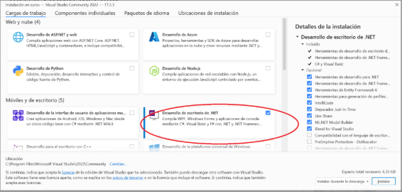

**nos basta con instalar Desarrollo de escritorio con .NET**.

Si alguien quiere instalarse la versión Enterprise (**PARA NUESTRO MÓDULO NO ES NECESARIO**) puede entrar en Microsoft Azure, que, como alumnos de la Consellería de Educación, os permite descargaros software de Microsoft. 


# <a name="_apartado4"></a>4. Explorar el entorno de desarrollo.
Como hemos dicho al ejecutar por primera vez tenemos la opción de iniciar sesión. Lo podemos hacer con el usuario **@alu.edu.gva.es** que tenemos asignado.

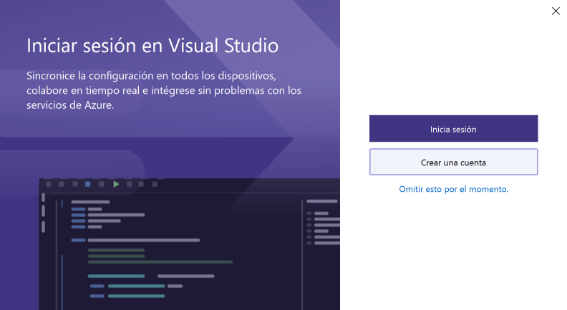

Dejaremos la configuración de desarrollo general:

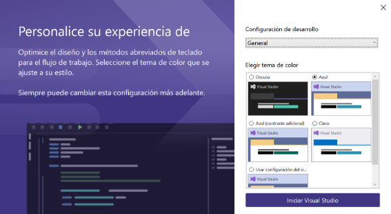

Al abrir Visual Studio, nos aparece una ventana inicial en la cual podemos abrir un proyecto ya creado o bien podemos crear uno nuevo. También podemos entrar en el entorno de trabajo directamente pulsando la opción “Continuar sin código” (De momento pulsaremos esta opción). 

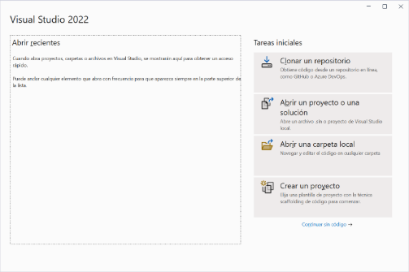

- **Creación de nuestro primer proyecto**

A continuación, vamos a crear un primer proyecto. Pulsaremos en el menú **Archivo -> Nuevo -> Proyecto…** y nos aparecerá la siguiente pantalla:

Elegiremos arriba como Lenguaje **C#** y como Plataforma **Windows**. Elegiremos a continuación como plantilla **Aplicación de Windows Forms**.

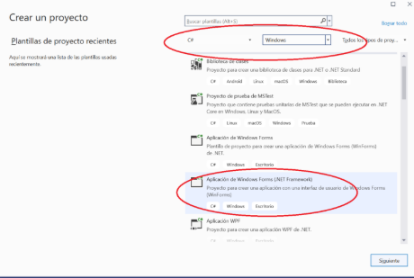

Además, elegiremos la carpeta en la que queremos guardar nuestro proyecto y el nombre del mismo.

Una vez tenemos creado el proyecto nos aparecerá el entorno con un aspecto similar al de la imagen que tenemos más abajo.

Vamos a ver por encima las principales partes del entorno y en el siguiente apartado veremos cómo realizar un pequeño programa.

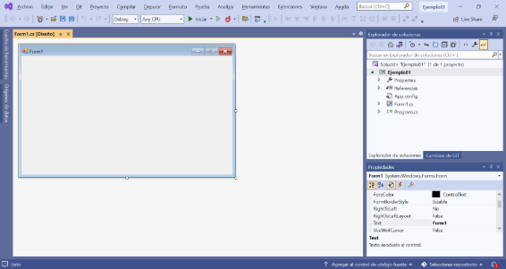

- **Menús y Barras de Herramientas.**

El menú principal y la barra de herramientas estándar proporcionan acceso a la mayoría de los comandos que controlan el entorno de programación de Visual Studio .NET.

Los comandos del menú principal funcionan igual que en todas las aplicaciones basadas en Windows, y podemos acceder a ellos utilizando el teclado o el ratón.

La barra de herramientas estándar proporciona botones que sirven como accesos directos a la mayoría de los comandos más habituales, como **Abrir**, **Guardar**, **Inicio**, **Añadir nuevo elemento**, **Ir hacia atrás** e **Ir hacia adelante**. También contiene botones que abren el Explorador de soluciones, la ventana de propiedades, el Cuadro de herramientas, y otros elementos importantes del entorno de desarrollo.

La barra de herramientas **Depurar** proporciona accesos directos a las funcionalidades de depuración, como ir paso a paso en el código y establecer puntos de interrupción.

Las barras de herramientas pueden estar acopladas (adjuntas) o desacopladas (flotantes). De forma predeterminada, la mayoría de las barras de herramientas están acopladas; sin embargo, podemos desacoplar o acoplar una barra de herramientas en cualquier momento.

- **Explorador de Soluciones.**

El Explorador de soluciones nos permite visualizar archivos y realizar tareas de administración de archivos en una solución o en un proyecto. Una única solución basada en Visual C# .NET y sus proyectos aparecen en una lista jerárquica que proporciona información actualizada sobre el estado de nuestra solución, proyectos y archivos.

Una ***solución*** es un recipiente para proyectos y elementos de solución que pueden incluirse en una aplicación. Normalmente, una solución contiene uno o más proyectos relacionados.

Un *proyecto* es un recipiente dentro de una solución que se utiliza para administrar, generar y depurar lógicamente los elementos de proyecto que constituyen nuestra aplicación.

Para abrir el explorador de soluciones en el menú **Ver**, haga clic en **Explorador de soluciones**.

- **Diseñador de Windows Forms.**

Cuando iniciamos un proyecto en Visual C# .NET, el Diseñador de Windows Forms se abre en la vista Diseño, mostrando el formulario *Form1* del proyecto. Ubicaremos los controles desde el Cuadro de herramientas en el formulario para crear el interfaz de usuario de una ventana utilizada en nuestra aplicación.

El formulario predeterminado contiene los elementos mínimos utilizados por la mayoría de formularios: una barra de título, un cuadro de control y los botones **Minimizar**, **Maximizar** y **Cerrar**.

Para visualizar un formulario en el Explorador de soluciones, haga doble clic en el formulario, o bien, haga clic en el botón **Ver Diseñador** de la barra de herramientas.

- **Cuadro de herramientas.**

Para crear los objetos del interfaz de usuario de nuestra aplicación, añadimos controles desde el Cuadro de herramientas a un formulario. Inicialmente, el Cuadro de herramientas se encuentra ubicado en el lado izquierdo del entorno de desarrollo. Hay varias pestañas para diferentes categorías de controles, como **Windows Forms** y **Datos**.

El Cuadro de herramientas contiene diversos controles que podemos utilizar para añadir **etiquetas, botones, cuadros de lista, barras de desplazamiento, menús**… a un interfaz de usuario. Cada control que añadimos a un formulario se convierte en un objeto de interfaz de usuario programable en nuestra aplicación. Estos objetos son visibles para los usuarios cuando la aplicación se ejecuta y funcionan como los objetos estándares de cualquier aplicación basada en Windows.

Para abrir el Cuadro de herramientas, en el menú **Ver**, hacer clic en **Cuadro de herramientas**.

- **Editor de Código.**

Visual Studio .NET proporciona un Editor de código en el que escribir y mantener el código de nuestro proyecto. Podemos asociar código directamente a un formulario de nuestro proyecto o ubicarlo en otro módulo de código distinto. Se muestra un Editor de código distinto para cada formulario o módulo de nuestro proyecto, facilitando la organización, visualización y desplazamiento por el código.

Para abrir el editor de código de un formulario en Explorador de soluciones, hacer clic en el formulario del que desea visualizar el código, o en el menú **Ver**, hacer clic en **Código**.

- **Ventana Propiedades.**

La ventana de propiedades (ventana Propiedades) muestra una lista de las propiedades que pueden configurarse para el formulario o control seleccionado y que podemos modificar mientras creamos o editamos la aplicación. Una propiedad describe una característica de un objeto, como el tamaño, título o color.

Si la ventana Propiedades no está visible, hacer clic con el botón derecho sobre el formulario y **Propiedades** o pulse la tecla **F4**.

Algunos controles, documentos y formularios muestran un gran número de propiedades en la ventana Propiedades. Esto puede dificultar la localización de la propiedad que deseamos establecer. La ventana Propiedades nos permite visualizar las propiedades de un formulario o control en una vista ordenada por categorías en lugar de una vista alfabética.

También se pueden ver en esta ventana los **Eventos** de los controles.


# <a name="_apartado5"></a>5. Ejemplo de Proyecto Visual C#.
Este apartado explica cómo crear una aplicación sencilla en Visual C# .NET. El objetivo es introducir al proceso de programación global, no proporcionar información detallada sobre la sintaxis del lenguaje ni la implementación, lo cual se hará en temas posteriores.

Visual C# contiene todo lo necesario para crear nuestras propias aplicaciones para Windows, de principio a fin. 

Para crear el interfaz de usuario, ubicamos **controles** en un formulario desde el Cuadro de herramientas. 

A continuación, personalizamos los controles estableciendo **propiedades**. Seguidamente, definimos qué debería hacer nuestro programa escribiendo el código.

Finalmente, podemos **guardar, ejecutar y compilar** nuestro programa para que otros también puedan utilizarlo.

**Ejemplo de proyecto paso a paso.**

A continuación, vamos a crear nuestro primer proyecto paso a paso en Visual C#.

1. Creamos un nuevo proyecto.

   Una vez abierto Visual Studio (o Visual C# Express) pulsamos el menú Archivo -> Nuevo Proyecto …

   Nos aparecerá una pantalla como la siguiente donde elegiremos como tipo de proyecto **Visual C#** y en tipo de Plantilla **Aplicación de Windows Form**. 

   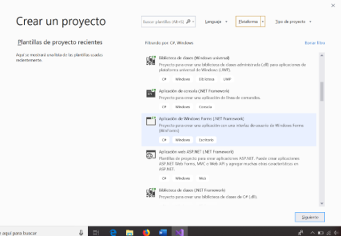

   A continuación, nos aparece una pantalla en la que podemos dar el nombre a nuestro proyecto y elegir la carpeta en la que queremos guardarlo (os recomiendo una carpeta para cada tema). Por ejemplo, aquí le llamamos **Ejemplo01.**

   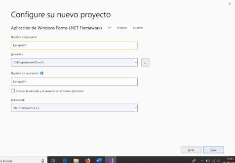

2. Empezamos a modificar nuestro proyecto.

   Entre los aspectos interesantes que vemos en la pantalla aparece lo que se llama un **formulario**. Este es el formulario principal de nuestra aplicación y es donde colocaremos las herramientas o controles (botones, textbox, labels) que nos van a permitir darle funcionalidad a nuestro programa. 

   Si apretamos el boton  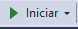 se **ejecutará** nuestra aplicación.

3. Cambiando propiedades de nuestro formulario.

   En nuestro proyecto aparece (a la derecha) la ventana **Propiedades** (Si no aparece la podemos mostrar con Menú Ver -> Ventana Propiedades). 

   Las propiedades de un formulario o control nos permiten cambiar el aspecto o comportamiento de ese control.

   Por ejemplo, la propiedad `BackColor` del formulario nos permite cambiar su color de fondo. 

   La propiedad `Text` nos permite cambiar el texto que aparece en la barra del formulario.


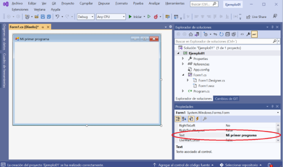

   Si ejecutamos después de haber cambiado esas propiedades, el resultado será parecido a esto:


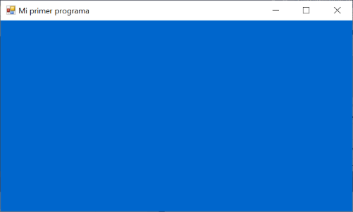

4. Añadiendo controles a nuestro formulario:

   Los controles son herramientas propias de aplicaciones Windows que nos permiten dar funcionalidad a nuestro programa.

   Los controles aparecen en la ventana **Cuadro de Herramientas**. (Podemos activarla con el menú Ver->Cuadro de Herramientas).

   **Vamos a añadir un botón a nuestro formulario**. Para ello, dentro de Controles comunes, pinchamos en el control Button y lo arrastramos al formulario. Nos aparece un botón con el texto Button1.

   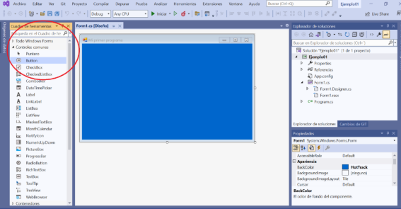

5. Cambiando las propiedades a un control.

   Los controles, al igual que los formularios, también tienen **Propiedades**. 

   Para cambiar las propiedades de un control (por ejemplo, un botón) debemos tener seleccionado dicho botón. Vamos a cambiar las siguientes propiedades de nuestro botón:

- Text: Botón.
- Name: btnPrimero.

   La propiedad Text de botón cambia el texto del botón.

   La propiedad Name no cambia el aspecto del botón, pero es la propiedad que le da nombre al mismo y que luego nos servirá para referenciarlo en el código del programa.

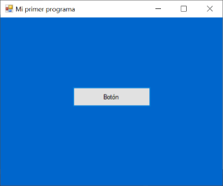

6. Respondiendo a un evento.

   Los eventos son sucesos que ocurren en las aplicaciones Windows, normalmente como resultado de la acción de un usuario.

   Por ejemplo, cuando un usuario hace Clic en un botón sucede el evento Click en dicho botón.

   Otros eventos pueden ser doble click, o pulsar el botón derecho del ratón, arrastrar un elemento …

   Nosotros podemos programar métodos o funciones que permitan responder a ese evento y realizar una acción cuando suceda ese evento en el control (en este caso el botón).

   Para acceder al método que responde al evento click del botón tenemos dos opciones:

- Pulsando el botón  en la ventana Propiedades accedemos a los eventos del control. Luego pulsaríamos el evento Click.
- Haciendo doble click sobre el botón.

Nos aparece la ventana de código:

```csharp
using System;
using System.Windows.Forms;

namespace Ejemplo01Tema01
{
    public partial class Form1 : Form
    {
        public Form1()
        {
            InitializeComponent();
        }

        private void bntPrimero_Click(object sender, EventArgs e)
        {
        }

    }
}

```

En temas posteriores nos introduciremos en la sintaxis de C# e iremos entendiendo las distintas partes del código. De momento únicamente nos interesa el método o subprograma btnPrimero\_Click. Éste es el método que se ejecutará cuando ocurra el evento click en el botón.

Ahora vamos a añadir código para que se ejecute cuando ocurra el evento click sobre el botón:

``` csharp
private void bntPrimero_Click(object sender, EventArgs e)
{
   MessageBox.Show("Hola Mundo. Este es mi primer programa en C#");
}
```

Vamos ahora a ejecutar de nuevo el programa  y pulsar sobre el botón de nuestra aplicación:

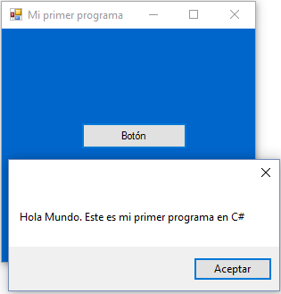

MessageBox.Show nos permite mostrar por pantalla un texto.

7. Guardar  nuestro proyecto.

   Para guardar nuestro proyecto lo mejor que podemos hacer es pulsar el botón **grabar todo** de la barra de herramientas.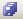


8. Añadir más controles y funcionalidad a nuestro formulario.

   Vamos a continuar nuestro ejemplo añadiendo tres nuevos controles a nuestro formulario:

   Añadiremos un control de tipo Button, otro de tipo Label y otro de tipo TextBox. Lo haremos en nuestro formulario, cogiendo esos controles de la ventana Cuadro de herramientas.

- En las propiedades del botón pondremos **Name:** btnSegundo, **Text:** Otro botón.
- En las propiedades del textbox pondremos **Name:** txtCuadroTexto.
- En las propiedades del Label pondremos **Name:** lblEtiqueta, **Text:** Texto.

El aspecto será similar al siguiente:

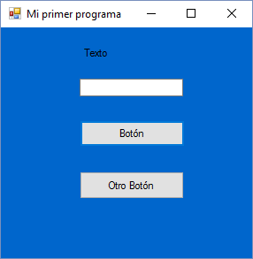

Vamos a añadir la siguiente funcionalidad a nuestro programa: 

Queremos que, al pulsar el botón, aparezca en la etiqueta el texto que haya escrito en el textbox.

Para ello en el evento click del botón escribiremos:

```csharp
        private void btnSegundo_Click(object sender, EventArgs e)
        {
            LEtiqueta.Text = TCuadroTexto.Text;
        }
```

De esta forma C# me permite cambiar propiedades de un control en tiempo de ejecución.

Ejecutar el programa y comprobar los resultados.

9. Errores de compilación

   Se pueden producir errores de compilación o sintácticos. Por ejemplo, si en el messagebox anterior hubiéramos puesto el texto sin comillas nos daría error. Visual Studio nos informa del error y nos permite arreglarlo.

```csharp
private void btnPrimeroClick(object sender, EventArgs e)
{
   MessageBox.Show(Hola Mundo. Éste es mi primer programa en C);
}
```

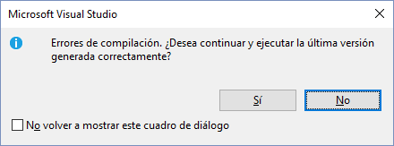

**Siempre pulsaremos No** para poder arreglar los errores de compilación.

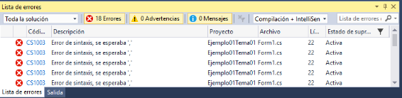


Haciendo doble click sobre el error nos permite ir a la línea donde tenemos el error de sintaxis y corregirlo.
